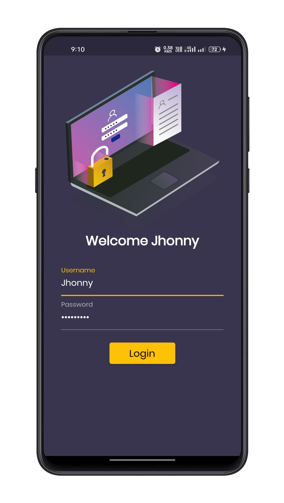
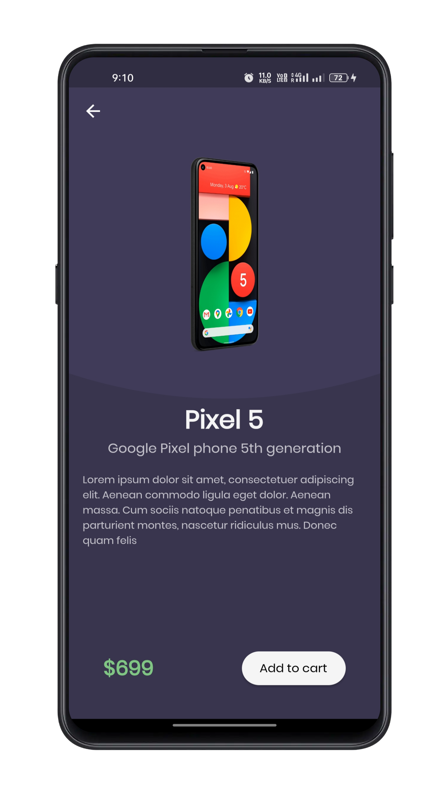
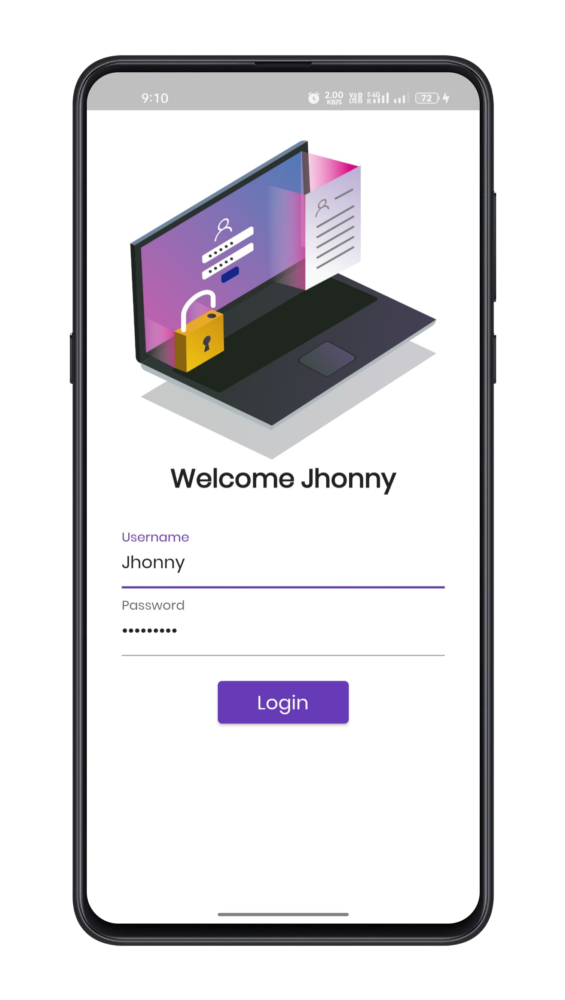
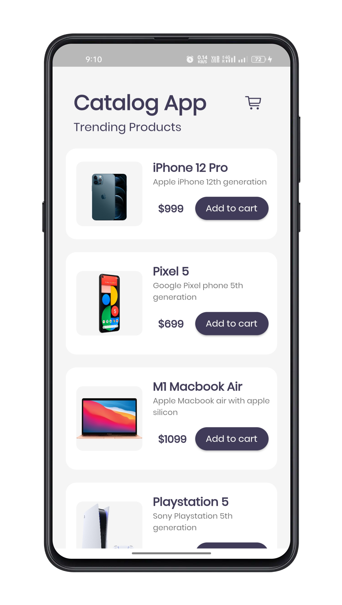
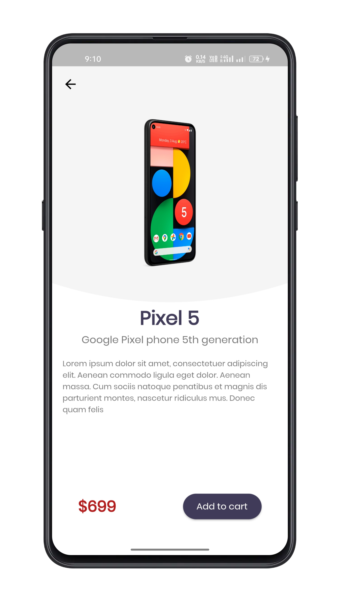

# **Catlog App**

UI concept for a e-shop with light and dark theme support changes with system theme

## **Screnshots**

Some of screenshots showing the UI built using flutter

### **Dark Theme** 🖤

### **Light Theme** 💡

## **Wanna Try?**

Head on to [Releases Page.](https://github.com/c0dysharma/catlog-app/releases)
Choose based on your device [ABI](https://github.com/c0dysharma/catlog-app/releases/tag/v1.0.0-abi) or get [AIO file.](https://github.com/c0dysharma/catlog-app/releases/download/v1.0.0/app-release.apk) ☮